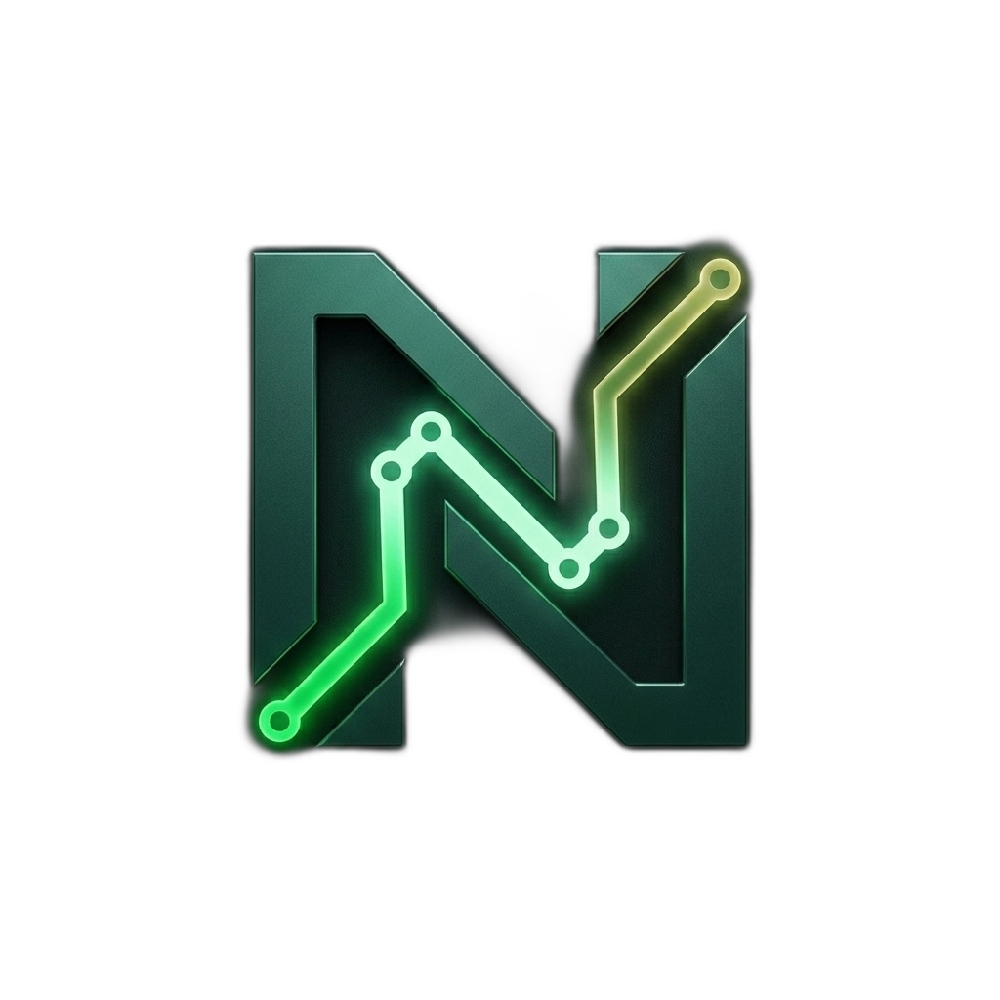

# NAvSU - Campus AR Navigation Landing Page

NAvSU is a real-time augmented reality navigation system designed to guide students, faculty, and visitors seamlessly across the campus. This repository contains the source code for the official NAvSU landing page.



##  Features
- **Interactive Campus Map**: Built with MapLibre GL JS, featuring dynamic custom markers, clustered navigation points, and geo-boundaries.
- **Modern UI/UX**: Designed with sleek, dark-mode aesthetics, custom micro-animations, and a dynamic interactive cursor glow.
- **Fully Responsive**: Optimized for seamless viewing across desktops, tablets, and mobile devices.
- **Working Contact Form**: Integrated with Web3Forms to securely route user inquiries directly to email without a backend server.
- **SEO Optimized**: Built with Next.js 15 App Router for blazing-fast performance and optimal search engine indexing.

##  Tech Stack
- **Framework**: Next.js (App Router)
- **Library**: React 
- **Mapping**: MapLibre GL JS & react-map-gl
- **Forms**: Web3Forms API
- **Styling**: Custom CSS Modules & Tailwind CSS v4

##  Getting Started

First, ensure you have Node.js installed. Then, clone the repository and install the dependencies:

```bash
# Install dependencies
npm install

# Run the development server
npm run dev
